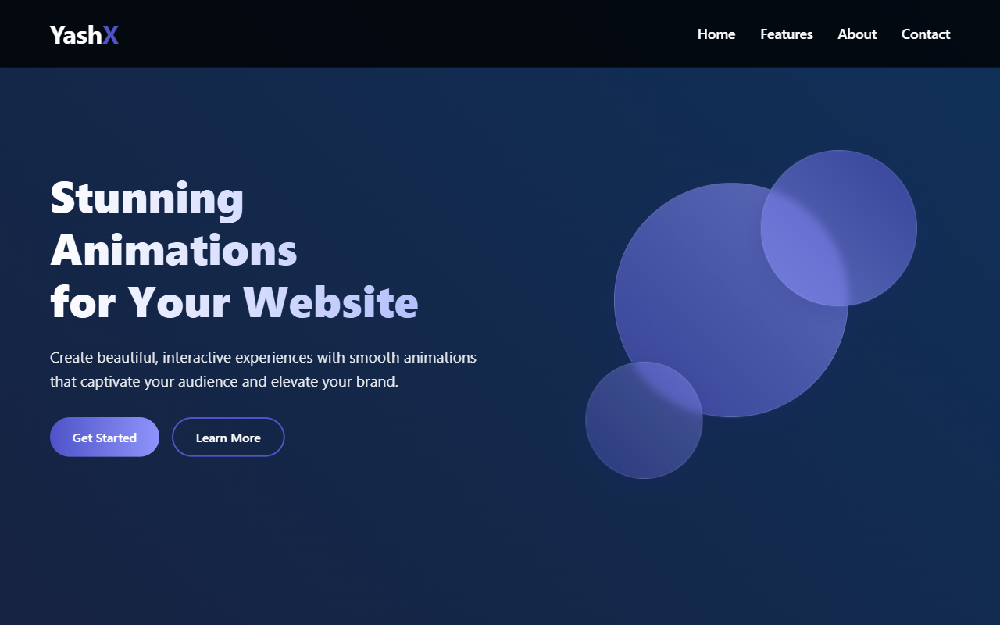

# Landing_Page

A modern, responsive landing page built with React and Vite, featuring smooth CSS animations and a clean design.



## Features

- Responsive design that works on all devices
- Smooth CSS animations and transitions
- Modern UI with gradient backgrounds
- Interactive elements with hover effects
- Clean and organized component structure

## Technologies Used

- React.js
- Vite
- CSS Animations
- Responsive Design

## Installation

1. Clone the repository
   ```bash
   git clone https://github.com/yashu2305/Landing_Page.git
   ```

2. Navigate to the project directory
   ```bash
   cd Landing_Page
   ```

3. Install dependencies
   ```bash
   npm install
   ```

4. Start the development server
   ```bash
   npm run dev
   ```

5. Open your browser and visit `http://localhost:5173`

## Project Structure

- `src/components/` - Contains all the React components
  - `Navbar.jsx` - Navigation bar component
  - `Hero.jsx` - Hero section with main animations
  - `Features.jsx` - Features section with animated cards
  - `About.jsx` - About section with animated stats
  - `Footer.jsx` - Footer component

## Customization

You can easily customize the colors, animations, and content by modifying the CSS files and component content.

## License

MIT
